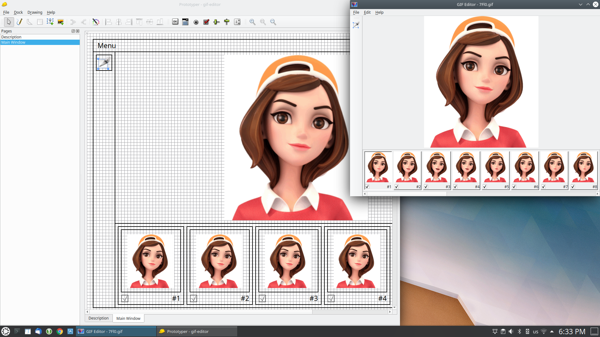
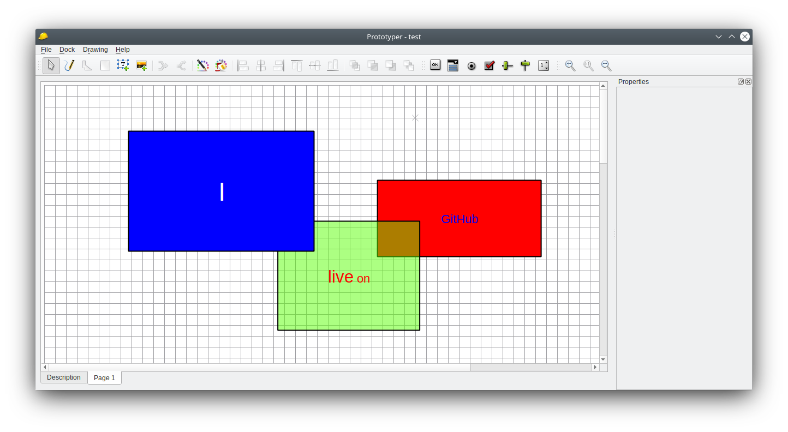

# About

Prototyper is a desktop application to make UI prototypes.

When you first time launch Prototyper you will see window with text editor (one and alone)
tab. This tabbed text editor is the place where you can describe
your new project.

Page for drawing can be created through the context menu on the tab, context menu in pages navigation
or through the menu. When you create page you will see tool bar with tools for drawing.

In such a way you describe prototype of you project. Once as you are ready
you can export your project to the PDF, HTML or SVG images of pages.

And Prototyper licensed under GNU GPL v3.0!!!

I see this application as pre-design prototyping software. Designers will find
this application useless. But If you want to describe idea for designer, then
this application can be usefull. And don't forget that this is absolutely free
software.

# Status

Under construction. **Testers and designers wanted!** Just contact me for Windows/Linux installations.

# Getting from Repository

After clone update submodules with the next command:

```
git submodule update --init --recursive
```

# Screenshots



